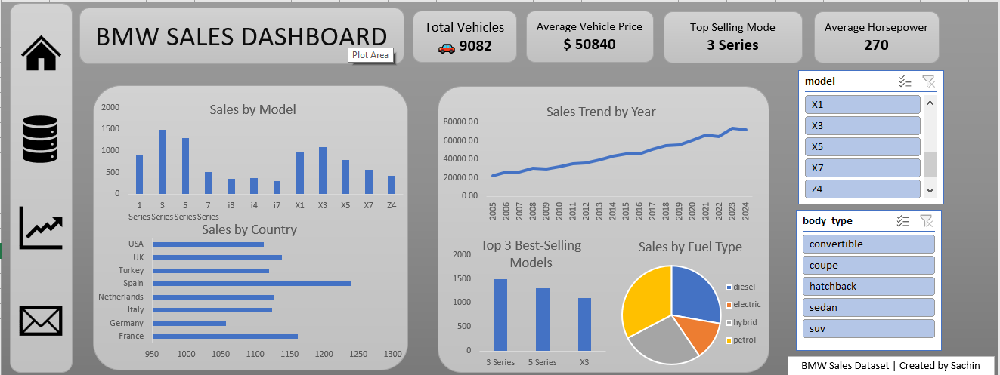

# 🚗 BMW Sales Dashboard

## 📊 Excel Dashboard Project | Sales Analysis | Data Visualization

An interactive **BMW Sales Dashboard** built using **Microsoft Excel** to analyze vehicle sales performance, yearly growth trends, fuel type distribution, and top-selling BMW models through dynamic visualizations and slicers.

---

# 📌 Overview

This project focuses on analyzing BMW vehicle sales data using Excel dashboarding techniques.
The dashboard provides business insights into:

* Total vehicle sales
* Sales trends over time
* Best-selling models
* Country-wise sales analysis
* Fuel type distribution
* Average pricing and horsepower analysis

The dashboard is fully interactive and updates dynamically using slicers.

---

# ❓ Problem Statement

Managing automobile sales data across multiple models, countries, and fuel types can be difficult without proper visualization tools.

The goal of this project is to build a centralized dashboard that helps:

✔ Monitor sales performance
✔ Identify top-performing BMW models
✔ Analyze yearly growth trends
✔ Compare sales across countries
✔ Understand fuel type preferences
✔ Support business decision-making with data insights

---

# 🗂️ Dataset Information

The dataset contains BMW vehicle sales records with the following fields:

* Vehicle Model
* Vehicle Price
* Horsepower
* Fuel Type
* Body Type
* Country
* Sales Year
* Total Vehicles Sold

Data cleaning and preprocessing were completed before dashboard development.

---

# 🛠️ Tools & Technologies Used

* Microsoft Excel
* Pivot Tables
* Pivot Charts
* Slicers
* KPI Cards
* Conditional Formatting
* Dashboard Design Techniques

---

# ⚙️ Methodology

### 1️⃣ Data Cleaning

* Removed duplicate records
* Handled missing values
* Standardized category names
* Verified data consistency

### 2️⃣ Data Preparation

* Organized sales metrics
* Created calculated fields
* Prepared summary tables for analysis

### 3️⃣ Pivot Table & Chart Creation

Built visualizations for:

* Sales by Model
* Sales by Country
* Sales Trend by Year
* Fuel Type Distribution
* Top-Selling Models

### 4️⃣ Dashboard Design

* Added KPI cards
* Implemented interactive slicers
* Applied consistent formatting
* Created business-friendly visual layouts

---

# 📊 Dashboard Features

## ✅ KPI Cards

* Total Vehicles Sold
* Average Vehicle Price
* Top Selling Model
* Average Horsepower

## ✅ Interactive Filters

* Vehicle Model Filter
* Body Type Filter

## ✅ Visualizations

* Sales by Model
* Sales Trend by Year
* Sales by Country
* Top 3 Best-Selling Models
* Sales by Fuel Type

---

# 📷 Dashboard Preview



---

# 💡 Key Insights

📌 Total vehicle sales reached **9,082 units**.

📌 **3 Series** became the top-selling BMW model.

📌 Average vehicle price was approximately **$50,840**.

📌 Sales showed continuous growth from **2005 to 2024**.

📌 Petrol and hybrid vehicles contributed significantly to total sales.

📌 Spain and France recorded strong sales performance.

📌 SUVs and sedans were among the most popular body types.

---

# 🚀 Conclusion

This project demonstrates how Microsoft Excel can be used to create professional and interactive business dashboards for automobile sales analysis.

The dashboard helps businesses:

* Track sales performance
* Identify growth opportunities
* Analyze customer preferences
* Make data-driven decisions efficiently

---

# 📁 Project Files

```bash
BMW_SALES_DASHBOARD/
│
├── BMW Sales Dashboard.xlsx
├── BMW Sales Dataset.csv
├── dashboard.png
└── README.md
```

---

# ⭐ Learning Outcomes

Through this project, I improved my skills in:

✔ Data Cleaning & Preparation
✔ Pivot Tables & Pivot Charts
✔ Interactive Dashboard Design
✔ Business Data Analysis
✔ Data Visualization in Excel
✔ Insight Generation

---

# 🔗 Author

**Sachin**

Aspiring Data Analyst | Excel | SQL | Python | Power BI
# 🔗 Connect With Me

- LinkedIn: www.linkedin.com/in/sachindevarajan


